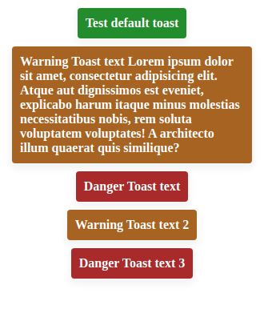

# TS-Toaster


### Run project

```bash
npm i && npm run dev
```

### Basic usage

```js
// Create instance of Toaster
const appToaster = new Toaster({
    maxToasts: 4, // Maximum toasts (default 5)
    lifeTime: 4000 // Life time for one toast in ms (default 5000)
});

// Call method 'showToast' with two required params
appToaster.showToast({
    type: 'default', // Toast can be of three types: 'default' || 'danger' || 'warning'
    text: 'Test default toast'
});
```
